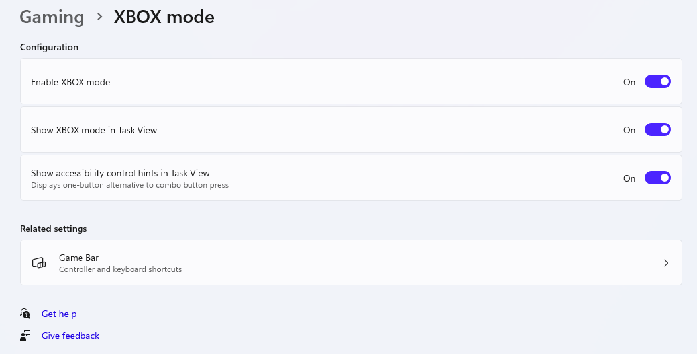
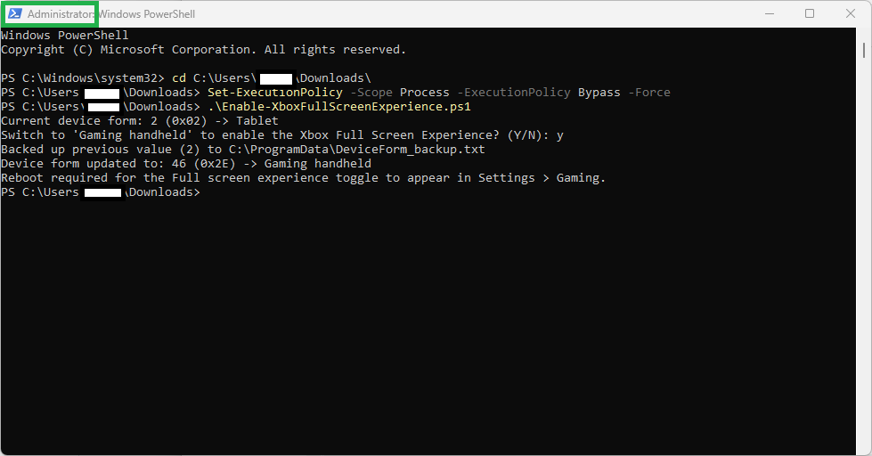
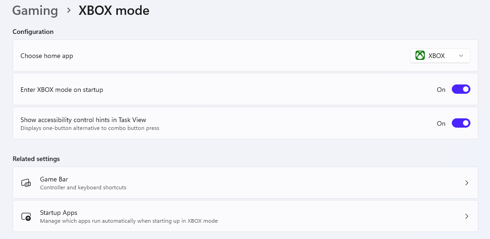
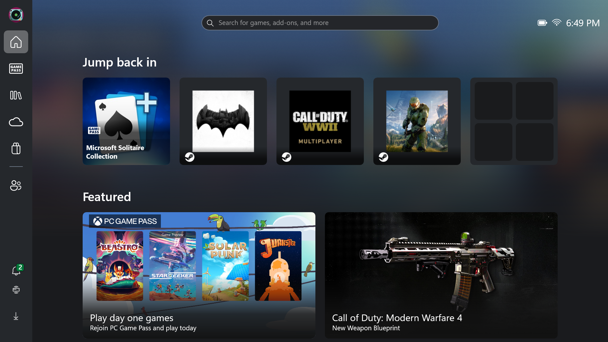

# Xbox Full Screen Experience Enabler

A small interactive PowerShell script that lets Windows handheld PCs (such as the ASUS ROG Ally) expose the **Full screen experience** toggle in **Settings > Gaming**, by switching the system's reported device form factor to `Gaming handheld`.

## Why

Windows determines whether to offer the Xbox Full Screen Experience partly based on a registry value called `DeviceForm`, under:

```
HKLM\SOFTWARE\Microsoft\Windows NT\CurrentVersion\OEM
```

On some handheld devices this value ships set to `Notebook` (or another non-handheld form factor) rather than `Gaming handheld` (`46` / `0x2E`), which hides the toggle. This script reads the current value, shows it in plain English, and — only if you confirm — switches it.

See Microsoft's own reference table for the full list of `DeviceForm` values: [DeviceForm — Microsoft Learn](https://learn.microsoft.com/en-us/windows-hardware/customize/desktop/unattend/microsoft-windows-deployment-deviceform)

## Disclaimer

This script edits the Windows registry. While it backs up the previous value before changing it, editing the registry always carries some risk. Use at your own discretion. This is not an official Microsoft or ASUS tool, and there is no guarantee this setting alone enables the Full Screen Experience on every device — the feature's availability may also depend on your device model, Windows build, and OEM software (e.g. Armoury Crate SE).

## Requirements

- Windows 10/11
- PowerShell (run **as Administrator**)

## Usage

1. Download the script directly:
   [Enable-XboxFullScreenExperience.ps1](https://github.com/vinytek/Enable-XboxFullScreenExperience/releases/latest/download/Enable-XboxFullScreenExperience.ps1)

   Or via PowerShell:
   ```powershell
   Invoke-WebRequest -Uri "https://github.com/vinytek/Enable-XboxFullScreenExperience/releases/latest/download/Enable-XboxFullScreenExperience.ps1" -OutFile "Enable-XboxFullScreenExperience.ps1"
   ```
2. Open PowerShell **as Administrator**.
3. Navigate to the folder containing the script:
   ```powershell
   cd C:\path\to\folder
   ```
4. Allow the script to run for this session (it isn't signed):
   ```powershell
   Set-ExecutionPolicy -Scope Process -ExecutionPolicy Bypass -Force
   ```
5. Run it — no arguments needed:
   ```powershell
   .\Enable-XboxFullScreenExperience.ps1
   ```
6. Follow the prompts. Reboot when asked, for the change to take effect.

### What it does

- Reads the current `DeviceForm` value and shows its name (e.g. `4 -> Notebook`).
- If a backup from a previous run exists, offers to **restore** the old value or **delete** the backup.
- If the device isn't already `Gaming handheld`, asks **Y/N** before making any change.
- Before changing anything, it saves the current value to:
  ```
  C:\ProgramData\DeviceForm_backup.txt
  ```
  so you can revert later by running the script again and choosing **Restore**.

## Screenshots

**Before** — Settings > Gaming, no Full screen experience toggle:



**Running the script** (PowerShell, elevated):



**After** — Settings > Gaming, toggle now available:



**Result** — Xbox Full Screen Experience running:



## Reverting

Run the script again — if a backup exists, it will offer to restore your original value.

## License

MIT — see [LICENSE](./LICENSE).
